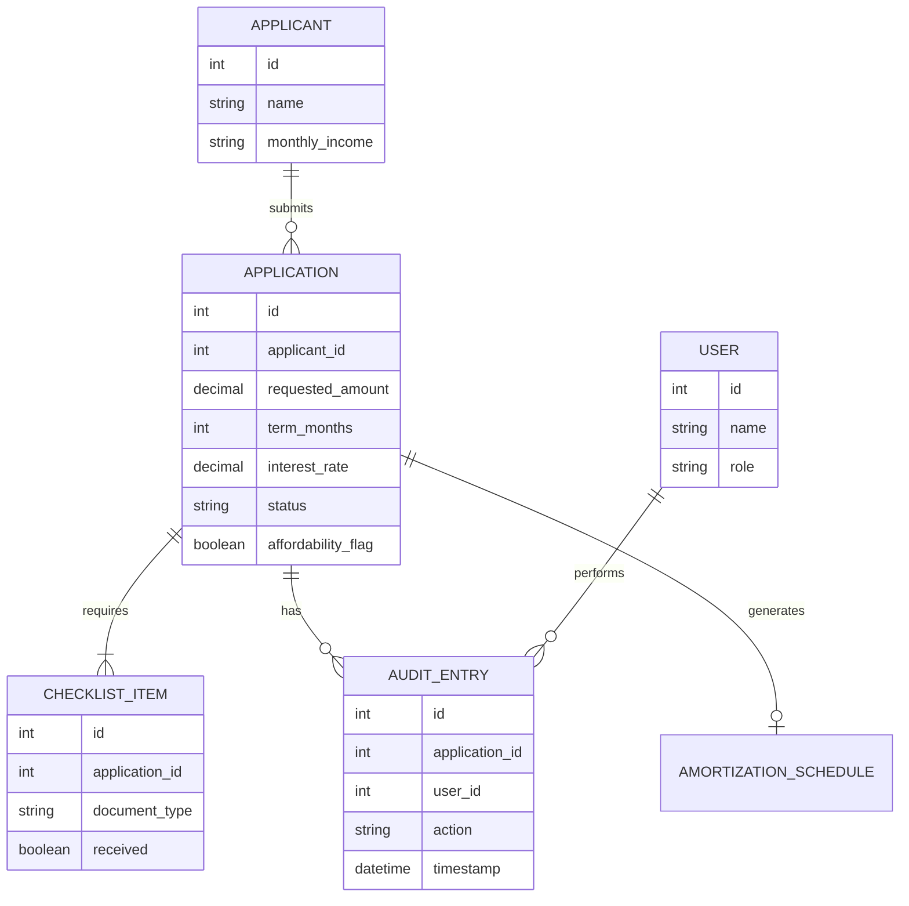
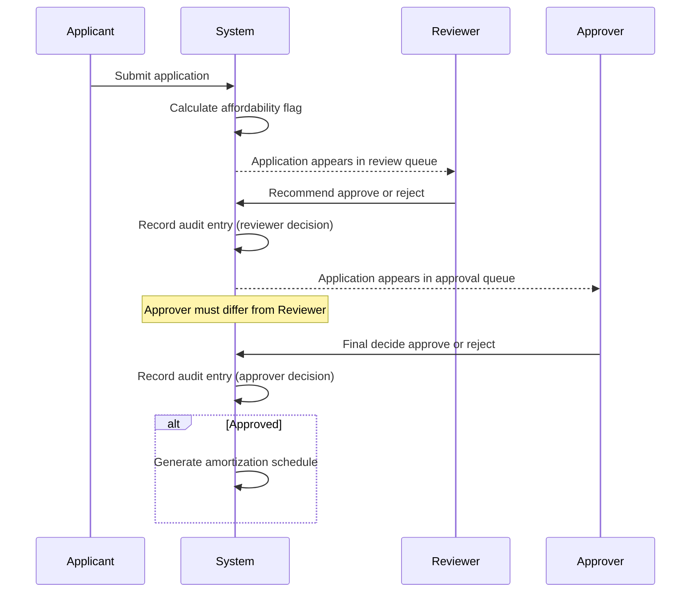

# Worked Example: LoanDesk (Financial Services)

This is a completed reference example, not a template to copy text from. It exists so you can see what "done" looks like before you write your own five. Match its structure, depth, and honesty, not its exact wording. Each of your engagements follows this same shape in a different domain.

The matching mockup is at `examples/worked-example-loandesk/mockup.html`. Open it directly in a browser.

---

## 1. Feasibility Note

**Build cost estimate:** This mockup took roughly 6 hours across one working day: 1.5 hours requirements and design, 3 hours directing the AI coding agent and correcting its output, 1 hour testing, 0.5 hours writing this document. At a junior developer billing rate of $25/hour, that is **$150** to produce the mockup. A production version (real auth, a real database, the two-step approval workflow enforced server-side, audit logging that cannot be tampered with) would reasonably take 3 to 4 weeks for one developer, roughly **$4,800 to $6,400** at the same rate.

**Run cost estimate**, assuming 500 loan applications a month in production:
- Hosting and a small managed database: approximately $25/month (a single small server instance plus a managed Postgres tier)
- AI usage: this engagement has no AI feature in scope, so $0/month
- Total estimated run cost: **~$25/month** at this volume, scaling roughly linearly with application volume up to a few thousand applications a month before a bigger instance is needed

**Reasoning:** The build estimate is based on the actual time spent building this mockup, scaled up by the usual multiplier (3 to 5x) for hardening a mockup into a real system, since authentication, real permission enforcement, and an audit trail resistant to tampering are the parts that take the most additional time. The run cost is a standard small-business hosting estimate, not a startup-scale estimate, since the client described here is a small microfinance lender, not a high-volume consumer product.

---

## 2. SRS (Software Requirements Specification)

**Functional requirements:**
- FR1: An applicant can submit a loan application (name, requested amount, term in months, stated purpose, monthly income).
- FR2: The system tracks a document checklist per application (proof of income, ID, proof of address) with each item markable as received.
- FR3: The system calculates and displays affordability automatically: an application is flagged as "affordability concern" if the calculated monthly repayment would exceed 40% of stated monthly income.
- FR4: A reviewer can recommend approval or rejection. A separate approver must independently decide; the same person cannot fill both roles on one application.
- FR5: On approval, the system generates a full amortization schedule (monthly principal, interest, and remaining balance) for the approved amount, term, and interest rate.
- FR6: Every status change on an application (submitted, document received, reviewed, approved, rejected) is recorded in an audit trail with who did it and when.

**Domain rule surfaced during requirements analysis, not stated in the original brief:** the brief only said "we do not want to lend to people who cannot pay it back." Asking the AI assistant, acting as a stand-in domain expert, and then checking its answer against published microfinance lending guidance, surfaced the standard microfinance affordability threshold (repayment should not exceed roughly 30 to 40% of stated monthly income) and the two-person approval separation (recommend versus decide) as a standard fraud and error control in small lending, not something the client would have thought to specify. Both became FR3 and FR4.

**Out of scope:** real identity verification against a government database, real credit bureau checks, real disbursement of funds, multi-currency support.

---

## 3. System and Database Design

**Components:** a single-page application (in the real build, this would be a proper frontend and backend; in this mockup, one HTML file holds the UI and an in-memory JavaScript array stands in for the database). No authentication is implemented in the mockup; the real build would need it, which is called out in the ship-readiness note below.

**Key tradeoff:** the mockup keeps all applications in a single in-page JavaScript array rather than simulating multiple linked tables, because the point of this artifact is to demonstrate the workflow and the affordability logic clearly, not to prove a normalized schema can be implemented. The schema below is what the real system would use.

**Database schema (for the real system):**

**Critical flow, the two-step approval:**

---

## 4. Agent Direction Log

Directed Claude Code with a spec covering the six functional requirements above, the schema, and the two sequence diagrams. Asked it to build a single self-contained HTML file with inline CSS and JavaScript, using an in-memory array for applications.

- What it got right on the first pass: the application intake form, the checklist display, and the amortization schedule calculation (correct standard amortization formula).
- What had to be corrected: its first pass let the same fixture "user" both recommend and approve the same application. Corrected by adding an explicit check that blocks the approval action if the current reviewer name matches the recommending reviewer's name on that application, and added a visible warning message when this is blocked, since FR4 is the single most important rule in this engagement.
- Second correction: the affordability flag was initially calculated on the requested amount only, not the actual monthly repayment given the term and rate. Corrected by calculating the estimated monthly repayment first, then comparing that to 40% of income.

---

## 5. Test Sheet

| What was checked | Result | Notes |
|---|---|---|
| Submit an application with all fields filled | Pass | Appears in the review queue |
| Application with monthly repayment over 40% of income | Pass | Affordability flag shown in red |
| Application with monthly repayment under 40% of income | Pass | No flag shown |
| Reviewer recommends approval | Pass | Moves to approver queue |
| Same person attempts both reviewer and approver role | Pass (defect found and fixed) | Initially allowed, blocked after correction, see Agent Direction Log |
| Approved application generates amortization schedule | Pass | Verified totals sum correctly against principal plus total interest |
| Audit trail shows every status change with actor and timestamp | Pass | |
| Rejected application does not generate a schedule | Pass | |

**Regression test tied to a real defect:** the "same person cannot review and approve" check above is the regression case. It is now checked on every test pass since it was the one real defect found during the build, per FR4's importance.

---

## 6. Ship-Readiness Note

To take this from mockup to production: real authentication and role-based access control (currently any user can act as any role, since the mockup uses a role dropdown rather than real login), a real relational database replacing the in-memory array so data survives a page refresh, server-side enforcement of the reviewer/approver separation (currently enforced only in the frontend, which a direct API call could bypass), and an audit trail written to an append-only log or table rather than a mutable array, since the current version could technically be edited by anyone with browser developer tools.

## 7. Retrospective

What went well: surfacing the affordability rule and the two-person approval rule as unstated domain requirements before building anything, rather than discovering them mid-build. What I would do differently: I should have written the test sheet's role-separation case before building, since it caught a real defect that a test-first approach would have prevented rather than found afterward. In a real run this retrospective would also compare pacing and quality with the previous engagement; from your Engagement 2 onward, yours should.
