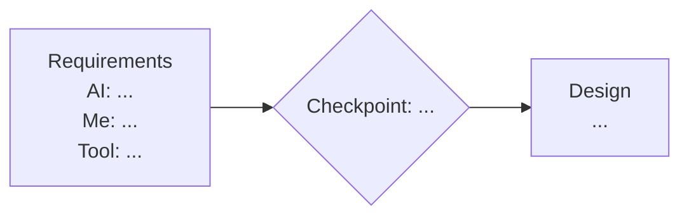

# 3. Your AI Pipeline

AI now writes most of the code. What separates a strong engineer is how they run it: where AI is used, where a human checks it, which tools do what, and what context the AI works from. On this project you document your own pipeline in `docs/ai-pipeline.md`, and you prove it with the files in your repository.

Draft it on Day 2, right after you learn the SDLC material in [guide/01-learn.md](01-learn.md) and set up your repository in [guide/02-structure.md](02-structure.md), and before you touch Engagement 1. Update it as you learn. Finish it on Day 13 so it describes what you **actually** did, not what you planned.

---

## What `docs/ai-pipeline.md` Must Contain

### Part 1: The pipeline diagram

One diagram covering every stage of your lifecycle, from brief to presentation. For each stage, show:

- what the **AI** does
- what **you** do
- the **tool** used
- the **human checkpoint**: where you review before moving on

The stages are at least: Requirements, Design, Spec, Build, Test, Ship-Readiness, Present. Add any others you use.

Use any tool you like: Mermaid, draw.io, Excalidraw, a whiteboard photo, or similar. Whatever you use, it must drop into `docs/ai-pipeline.md` and display inline, with no separate app needed to read it. Text-based tools like Mermaid render directly on GitHub; if you use a drawing tool, save it as an image and embed it with a markdown image link.

The example below uses Mermaid because it renders inline here, but this shows the format only, not the required tool. Yours must be complete and your own:



### Part 2: Tools

A table: each tool, the stages it is used in, why you chose it, and what you deliberately do **not** use it for.

### Part 3: Methodologies

Name the methods you follow and point to where each one shows up in your repository. For example:

- Spec-driven development: the spec is written before the agent builds (`context/scenario-N-name/spec.md`)
- Test-first on the key rule: the worst-failure test is written before the build
- Human review gates: the checkpoints in your diagram
- Plan before execute: the agent proposes a plan and you approve it before it writes code

Only list methods you really used. The reviewer checks.

### Part 4: Context management

How you decide what the AI knows at each moment. Include:

1. **Your folder tree**, with every context file marked and a one-line purpose for each. At minimum:

   ```
   CLAUDE.md                       project context, loaded every session
   .claude/skills/                 reusable skills (teach-me, troubleshoot, any you add)
   context/scenario-N-name/spec.md the spec for one engagement
   ```

2. **Global versus per-engagement context:** what goes in `CLAUDE.md` for every session, and what stays in one engagement's spec.
3. **Session hygiene:** when you start a fresh agent session, and why.
4. **What never goes in context:** secrets, real personal data, anything under NDA.
5. **How lessons flow back:** when the agent gets something wrong, how that correction reaches `CLAUDE.md` so it does not happen in the next engagement. Show at least one real example.

### Part 5: What changed

A short paragraph comparing your Day 2 draft with your final version.

---

## The Files That Prove It

| File | What goes in it |
|---|---|
| `CLAUDE.md` | Your project context file. Starts as a stub; you fill it on Day 2 and keep it current. If you use another tool, keep the same content in its equivalent file and say so in Part 2 |
| `context/scenario-N-name/spec.md` | The spec for each engagement, committed **before** the mockup |

Your commit history shows whether specs came before builds and whether `CLAUDE.md` grew as you learned. The reviewer looks at both.
